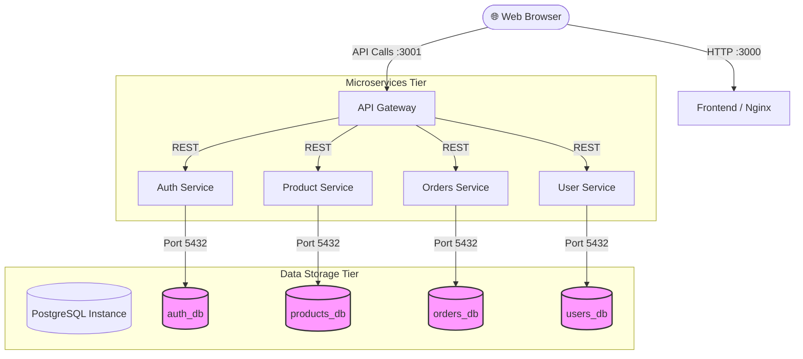
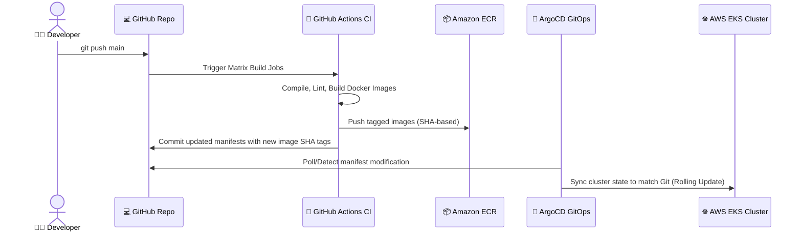

# High-Level Architecture

This document outlines the distributed system architecture, reliability models, service orchestration, and continuous delivery loops implemented in this project.

---

## 🏗️ Architectural Overview

The boutique application is designed as a **decomposed, distributed microservices system** optimized for independent scaling, bounded domains, and high reliability in cloud environments.

---

## 🌐 Reliability & High Availability (HA) Model

### 1. Multi-Availability Zone Topology
In AWS production, the EKS cluster and its compute assets are deployed across **3 distinct Availability Zones (AZs)**:
* `us-east-1a`, `us-east-1b`, `us-east-1c`.
* Computes are partitioned into private subnets while the public ingress load balancers reside in public subnets.
* If a physical AZ fails, AWS autoscaling and Kubernetes scheduling redistribute pods onto nodes in active AZs.

### 2. Node Group Pod Capacity
* To support the numerous microservices, database, monitoring stack, and replicas, EKS Node Groups utilize larger instance types (e.g., `t3.large` or `m7i-flex.large`) with a high pod limit (up to 35+ pods per node).

### 3. Stateful Storage Resilience
* PostgreSQL database state is mounted to **AWS EBS volumes** via Kubernetes **StatefulSets**.
* Managed via the **EBS CSI Driver** using AWS IAM Roles for Service Accounts (IRSA) to authorize Kubernetes storage provisions securely.

---

## 🚀 Service Discovery & Load Balancing

Kubernetes coordinates internal networking, abstracting complex IP routing with virtual, stable DNS layers:

* **Internal Load Balancing**: Done by Kubernetes ClusterIP services. Incoming traffic is distributed to pod replicas using round-robin scheduling controlled by `kube-proxy`.
* **Stable DNS Resolution**: Downstream pods do not refer to raw IPs. Connections resolve using Kubernetes CoreDNS:
  * Gateway calls `http://auth:3002`, `http://product-service:3003`, `http://orders:3005`, and `http://user-service:3006`.
* **External Ingress**: An Application Load Balancer (ALB) routes public traffic from the web to the Frontend and API Gateway services.

---

## 🔄 The Continuous Delivery (GitOps) Loop

The repository adheres to GitOps principles, asserting that **Git is the single source of truth** for infrastructure and application states.

### GitOps Sync Workflow
1. **GitHub Actions (CI)**: Builds individual Docker images for all modified services, tags them with the git commit SHA, and pushes them to AWS ECR.
2. **Manifest Upgrades**: The CI pipeline updates the image tags in the Kustomize manifests (`gitops/k8s/`) and commits them back to `main`.
3. **ArgoCD Continuous Deployment (CD)**: Detects differences between EKS states and the repository configuration.
4. **Automated Reconciliation**: ArgoCD initiates a rolling update in EKS, deploying the new Docker containers without downtime.
