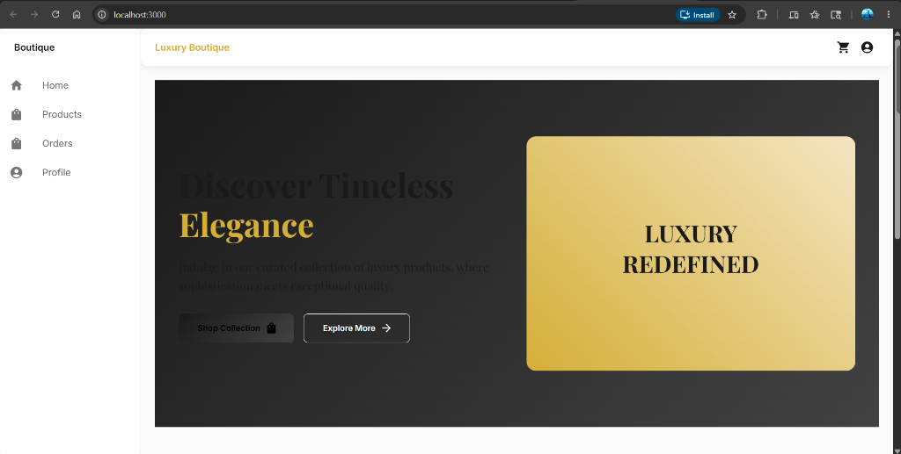
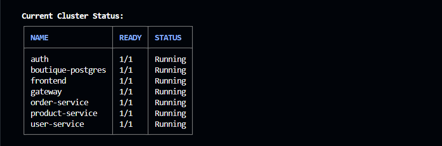
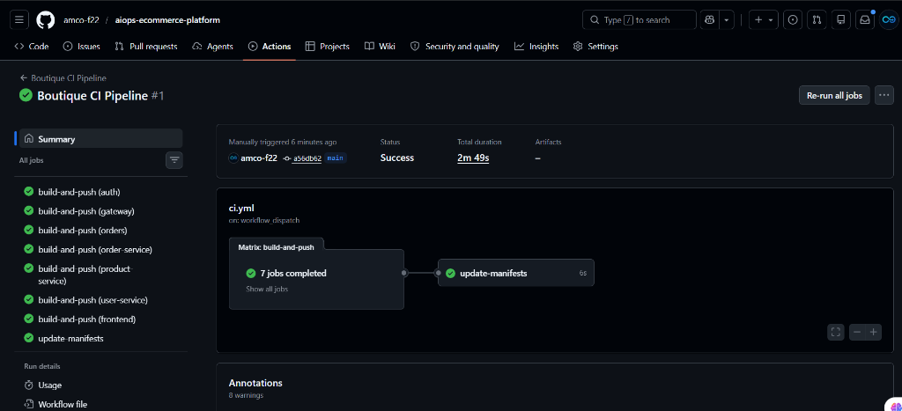
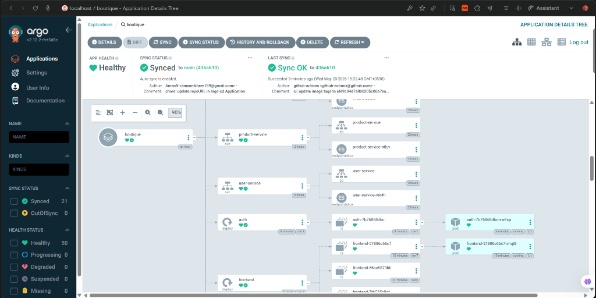

# 🚀 AIOps E-Commerce Platform

> An end-to-end DevOps and AIOps platform built around a microservices-based e-commerce application — covering local development, cloud infrastructure, CI/CD automation, GitOps delivery, observability, and AI-powered operations.

---

## 💡 What I Built

This project demonstrates a production-grade DevOps pipeline from scratch. I designed and deployed a boutique e-commerce application composed of seven microservices, backed it with automated infrastructure provisioning, continuous integration, GitOps-based continuous delivery, full-stack observability, and an AI-powered operations assistant.

The goal was to build a system where a single code push flows through the entire lifecycle — from container build to production deployment — without manual intervention, while an AI agent monitors the cluster health in real time.



### Key Workflows Implemented

| # | Workflow | What It Does |
|---|----------|--------------|
| 1 | 🐳 **Local Development** | Full application stack running locally via Docker Compose for rapid testing |
| 2 | 🏗️ **Infrastructure as Code** | One-command AWS provisioning (VPC, EKS, ECR, ArgoCD, Monitoring) using Terraform modules |
| 3 | ⚡ **CI/CD Pipeline** | GitHub Actions builds 7 Docker images in parallel and pushes them to ECR |
| 4 | 🔄 **GitOps Delivery** | ArgoCD watches the Git repository and auto-syncs cluster state on every manifest change |
| 5 | 📊 **Observability** | Prometheus metrics collection + Grafana dashboards with pre-loaded panels for all services |
| 6 | 🤖 **AIOps** | AWS Bedrock-powered AI agent (Iris) for automated cluster troubleshooting |

---

## 🏛️ Architecture

### Application Architecture

The application is a boutique e-commerce platform with a React frontend served by Nginx acting as a reverse proxy. All client requests flow through a single entry point — the API Gateway — which inspects the request path and routes it to the appropriate internal microservice. This keeps the frontend simple (it only talks to one address) and centralizes API management.

Each microservice owns its own logical database within a shared PostgreSQL instance, enforcing service isolation and preventing tight coupling between components.

```
                                    ┌─────────────┐
                                    │   Frontend  │
                                    │  (Nginx)    │
                                    │  Port 3000  │
                                    └──────┬──────┘
                                           │
                                    ┌──────▼──────┐
                                    │ API Gateway │
                                    │  Port 3001  │
                                    └──────┬──────┘
                                           │
            ┌──────────────────────────────┼──────────────────────────────┐
            │                              │                              │
     ┌──────▼──────┐              ┌────────▼────────┐           ┌────────▼────────┐
     │    Auth     │              │ Product Service │           │  User Service   │
     │  Port 3002  │              │    Port 3003    │           │    Port 3006    │
     └──────┬──────┘              └────────┬────────┘           └─────────────────┘
            │                              │
     ┌──────▼──────┐              ┌────────▼────────┐
     │Order Service│              │     Orders      │
     │  Port 3004  │              │    Port 3005    │
     └─────────────┘              └─────────────────┘
            │
     ┌──────▼──────────────────────────────────────────────────┐
     │                    PostgreSQL                           │
     │   auth_db  │  products_db  │  orders_db  │  users_db   │
     └────────────────────────────────────────────────────────-┘

     ┌─────────────────────────────────────────────────────────┐
     │              Observability Stack                        │
     │   Prometheus (metrics) ◄──── Grafana (dashboards)       │
     └─────────────────────────────────────────────────────────┘
```

### Services Breakdown

| Service | Port | Responsibility |
|---------|------|----------------|
| **Frontend** | 3000 | React SPA served by Nginx reverse proxy. Routes `/api/*` requests to the Gateway |
| **API Gateway** | 3001 | Central entry point. Inspects request paths and routes to internal services |
| **Auth** | 3002 | User registration, login, and JWT token issuance |
| **Product Service** | 3003 | Product catalog and inventory management |
| **Order Service** | 3004 | Cart operations and checkout processing |
| **Orders** | 3005 | Order history and order management |
| **User Service** | 3006 | User profiles and account management |
| **PostgreSQL** | 5432 | Single instance with 4 logically separated databases |

### Infrastructure Architecture

All cloud infrastructure is defined as code using Terraform and organized into reusable modules:

| Module | Resources Created |
|--------|-------------------|
| **VPC** | Custom VPC, 3 public subnets across `us-east-1a/b/c`, Internet Gateway, Route Tables |
| **EKS** | Managed Kubernetes cluster (v1.34), Worker Node Group (`m7i-flex.large`), IAM roles, OIDC provider, EBS CSI driver |
| **ECR** | 7 private container registries (one per microservice) |
| **ArgoCD** | ArgoCD + kube-prometheus-stack deployed via Helm provider directly through Terraform |

A single `terraform apply` provisions **32 AWS resources** end-to-end.

### Deployment Pipeline

```
Developer pushes code
         │
         ▼
GitHub Actions CI Pipeline (ci.yml)
         │
         ├── build-and-push (7 parallel matrix jobs)
         │     └── Authenticate AWS → Build Docker image → Tag with commit SHA → Push to ECR
         │
         ▼
         ├── update-manifests (runs after all builds succeed)
         │     └── sed replaces image tags in gitops/k8s/ → Commits updated manifests back to main
         │
         ▼
ArgoCD (running inside EKS cluster)
         │
         └── Detects manifest change → Syncs cluster state → Kubernetes performs rolling update
```

---

## 📁 Repository Structure

```
aiops-ecommerce-platform/
├── .github/
│   └── workflows/
│       └── ci.yml                    # GitHub Actions CI pipeline
├── docs/
│   ├── part1-system-design.md        # System design concepts applied in this project
│   ├── part2-workflow.md             # End-to-end workflow documentation
│   └── claude-setup.md              # Claude Code and MCP server configuration
├── gitops/
│   ├── argo-cd.yml                   # ArgoCD Application manifest
│   ├── kustomization.yml             # Kustomize entry point for all resources
│   ├── namespace.yml                 # Boutique namespace definition
│   ├── secrets.yml                   # Database connection secrets
│   └── k8s/
│       ├── backend/                  # Deployment + Service per backend microservice
│       ├── frontend/                 # Frontend Deployment + Service
│       ├── database/                 # PostgreSQL StatefulSet, Service, restore Job
│       └── grafana-dashboard.yml     # Pre-loaded Grafana dashboard (ConfigMap)
├── projects/
│   ├── boutique-microservices/       # Application source code (7 services)
│   │   ├── backend/services/         # Auth, Gateway, Product, Order, Orders, User
│   │   ├── frontend/                 # React SPA with Nginx config
│   │   ├── database/                 # SQL init scripts
│   │   └── docker-compose.yml        # Local orchestration
│   ├── Infrastructure/               # Terraform IaC
│   │   ├── main.tf                   # Root module wiring VPC → EKS → ECR → ArgoCD
│   │   ├── terraform.tfvars          # Environment-specific values
│   │   └── modules/                  # vpc/, eks/, ecr/, argocd/
└── aiops-assistant/              # AWS Bedrock AI agent (Iris)
│       ├── app.py                    # Streamlit chatbot interface
│       ├── deploy.sh                 # Bedrock agent deployment script
│       ├── setup-iam.sh              # IAM role and policy configuration
│       └── lambda/                   # Python action handlers for AI agent
├── CLAUDE.md                         # AI assistant system prompt
└── README.md                         # This file
```

---

## 🛠️ Tech Stack

| Layer | Technology |
|-------|-----------|
| **Application** | React, Node.js (TypeScript), Express, PostgreSQL |
| **Containerization** | Docker, Docker Compose |
| **Orchestration** | Kubernetes (AWS EKS) |
| **Infrastructure** | Terraform (modularized) |
| **CI/CD** | GitHub Actions (matrix strategy) |
| **GitOps** | ArgoCD + Kustomize |
| **Monitoring** | Prometheus + Grafana |
| **Log Forwarding** | AWS Fluent Bit → CloudWatch |
| **AIOps** | AWS Bedrock Agent (Iris) |
| **AI Assistant** | Claude Code + MCP Servers |

---

## 📋 How to Replicate This Project

### ✅ Prerequisites

Make sure the following tools are installed and configured on your machine before starting:

| Tool | Version | Purpose |
|------|---------|---------|
| [Docker Desktop](https://www.docker.com/products/docker-desktop/) | Latest | Build and run containers locally |
| [Node.js](https://nodejs.org/) | 18+ | Build the React frontend |
| [Terraform](https://developer.hashicorp.com/terraform/install) | ≥ 1.5 | Provision AWS infrastructure |
| [AWS CLI](https://docs.aws.amazon.com/cli/latest/userguide/install-cliv2.html) | v2 | Authenticate and interact with AWS |
| [kubectl](https://kubernetes.io/docs/tasks/tools/) | Latest | Manage Kubernetes resources |
| [Helm](https://helm.sh/docs/intro/install/) | v3 | Required by Terraform Helm provider |
| [Git](https://git-scm.com/) | Latest | Version control |

---

### 🐳 Phase 1 — Run Locally with Docker Compose

Before deploying anything to the cloud, validate the entire application stack locally. Docker Compose acts as a mini orchestrator for your laptop — it builds all the images, starts the containers in the correct dependency order, and wires them together on a shared network.

```bash
# Clone the repository
git clone https://github.com/YOUR_USERNAME/aiops-ecommerce-platform.git
cd aiops-ecommerce-platform

# Navigate to the application directory
cd projects/boutique-microservices

# Install frontend dependencies and build the React app
npm install
npm run build

# Start all services (frontend, backend, database, monitoring)
docker compose up -d --build
```

**Verify everything is running:**
```bash
docker ps
```

You should see containers for all 7 microservices plus PostgreSQL, Prometheus, and Grafana.

**Access the application:**

| Service | URL |
|---------|-----|
| Frontend | http://localhost:3000 |
| Prometheus | http://localhost:9090 |
| Grafana | http://localhost:3007 (admin / admin) |
| Gateway Metrics | http://localhost:3001/metrics |

> **Why Docker Compose first?** Deploying locally helps validate service integration, test database connectivity, and catch issues early — before committing to cloud costs. This is standard practice in most microservices teams.

**Stop everything when done:**
```bash
docker compose down
```

---

### 🏗️ Phase 2 — Provision Cloud Infrastructure with Terraform

With the application validated locally, provision the production infrastructure on AWS. All infrastructure is defined as Terraform modules — write once, deploy to any environment.

**Step 1: Configure AWS credentials**
```bash
aws configure
# Enter: Access Key ID, Secret Access Key, Region (us-east-1), Output format (json)

# Verify your identity
aws sts get-caller-identity
```

**Step 2: Initialize and apply Terraform**
```bash
cd projects/Infrastructure

# Download providers and initialize modules
terraform init

# Preview what will be created (expect ~32 resources)
terraform plan

# Deploy everything (~15 minutes)
terraform apply --auto-approve
```

Terraform will output the EKS cluster endpoint, cluster name, and ECR repository URLs when complete.

**Step 3: Connect kubectl to the EKS cluster**
```bash
aws eks update-kubeconfig --region us-east-1 --name eks-cluster

# Verify the node is ready
kubectl get nodes
```

**What gets deployed:**

| Resource | Details |
|----------|---------|
| VPC | Custom VPC with 3 public subnets across 3 AZs for high availability |
| EKS Cluster | Managed Kubernetes cluster (v1.34) with public API endpoint |
| Node Group | `m7i-flex.large` instances, 1–2 nodes, on-demand capacity |
| ECR | 7 private container registries |
| ArgoCD | Deployed via Helm into `argocd` namespace |
| Prometheus + Grafana | Deployed via `kube-prometheus-stack` Helm chart into `monitoring` namespace |

> **Design Decision:** ArgoCD and the monitoring stack are deployed through the Terraform Helm provider — not manually. This means a single `terraform apply` gives you a fully operational cluster with GitOps and observability baked in from the start. The Helm provider authenticates directly to EKS using the cluster token, so there is no need to run `helm install` commands manually.

---

### ☸️ Phase 3 — Deploy to Kubernetes

Each microservice has a corresponding Kubernetes Deployment and Service manifest in the `gitops/k8s/` directory. A Kustomize configuration ensures all resources are applied in the correct order (secrets first, then database, then application services).

**Apply all manifests at once:**
```bash
kubectl apply -k gitops/
```

**Monitor pod startup:**
```bash
kubectl get pods -n boutique -w
```



**Restore the database:**

The PostgreSQL StatefulSet uses an EBS volume for persistent storage. Due to the `lost+found` directory that exists on fresh EBS volumes, the init script gets skipped. A separate restore Job handles database initialization.

```bash
# Wait until the database pod shows READY 1/1
kubectl get pods -n boutique -l app=boutique-postgres

# Apply the restore job
kubectl apply -f gitops/k8s/database/restore-job.yml

# Monitor the job (should go Running → Completed)
kubectl get pods -n boutique -l job-name=boutique-db-restore -w

# Verify the restore succeeded
kubectl logs -n boutique -l job-name=boutique-db-restore
```

> **Troubleshooting:** If pods show `ImagePullBackOff`, the image tags in the manifests don't match what's in ECR. This is expected on the first deployment — the CI pipeline (Phase 4) will fix this automatically.

---

### ⚡ Phase 4 — Set Up the CI/CD Pipeline

The GitHub Actions pipeline (`.github/workflows/ci.yml`) uses a **matrix strategy** to build all 7 microservices simultaneously in parallel runners. After all builds succeed, a second job updates the image tags in the Kubernetes manifests and commits the change back to the repository.

**Step 1: Add AWS secrets to your GitHub repository**

Go to your repository → **Settings** → **Secrets and variables** → **Actions** → **New repository secret**

| Secret Name | Value |
|-------------|-------|
| `AWS_ACCESS_KEY_ID` | Your IAM user's access key |
| `AWS_SECRET_ACCESS_KEY` | Your IAM user's secret key |
| `AWS_REGION` | `us-east-1` (or your region) |
| `AWS_ACCOUNT_ID` | Your 12-digit AWS account number |

To find your account ID:
```bash
aws sts get-caller-identity --query Account --output text
```

**Step 2: Configure workflow permissions**

Go to repository **Settings** → **Actions** → **General** → scroll to **Workflow permissions** → select **Read and write permissions**. This allows the pipeline to commit the updated manifests back to the repository.

**Step 3: Trigger the pipeline**

The pipeline is configured with `workflow_dispatch` — trigger it manually from the **Actions** tab → **Boutique CI Pipeline** → **Run workflow**.

> **Why `workflow_dispatch` instead of `on: push`?** This prevents accidental deployments on every small commit. Once the pipeline is stable, you can switch to automatic triggers by changing the `on:` section to `push: branches: [main]`.

**Step 4: Verify images in ECR**
```bash
aws ecr describe-images \
  --repository-name frontend \
  --region us-east-1 \
  --query 'imageDetails[*].imageTags' \
  --output table
```

Each image is tagged with the Git commit SHA for full traceability. At any point, you can identify exactly which version is running in production and roll back by redeploying a previous commit SHA.



---

### 🔄 Phase 5 — Configure ArgoCD for GitOps

ArgoCD is already running inside the cluster (deployed by Terraform). It continuously monitors the `gitops/` directory in your GitHub repository. When the CI pipeline commits updated image tags, ArgoCD detects the change and automatically synchronizes the cluster state — no manual `kubectl apply` needed.

**Step 1: Create a GitHub Personal Access Token**

Go to GitHub → **Settings** → **Developer Settings** → **Personal Access Tokens** → **Tokens (classic)** → **Generate new token**

For a **private** repository, select the `repo` scope. For a **public** repository, select `public_repo` only.

**Step 2: Register the repository with ArgoCD**

```bash
# Port-forward the ArgoCD server to access the UI
kubectl port-forward svc/argocd-server 8443:443 -n argocd &

# Get the admin password
kubectl -n argocd get secret argocd-initial-admin-secret \
  -o jsonpath="{.data.password}" | base64 -d
```

Open https://localhost:8443 and log in with username `admin` and the password from above.

In the ArgoCD UI:
1. Go to **Settings** → **Repositories** → **Connect Repo**
2. Enter your GitHub repository URL and the Personal Access Token
3. Click **Connect**

**Step 3: Register the ArgoCD Application**

```bash
kubectl apply -f gitops/argo-cd.yml -n argocd
```

**Step 4: Verify sync status**
```bash
kubectl get application -n argocd
```

You should see `STATUS: Synced` and `HEALTH: Healthy`.

**How ArgoCD keeps the cluster in sync:**

The ArgoCD Application manifest (`gitops/argo-cd.yml`) is configured with:
- **`prune: true`** — If a manifest is removed from Git, the corresponding resource is deleted from the cluster
- **`selfHeal: true`** — If someone manually changes a deployment in the cluster (e.g., changes replicas from 3 to 5), ArgoCD automatically reverts it to match Git

This ensures Git is always the single source of truth for what is running in production.



---

### 📊 Phase 6 — Set Up Observability

#### Prometheus

Every backend microservice exposes a `/metrics` endpoint using the `prom-client` library. A `ServiceMonitor` resource tells Prometheus which pods to scrape and at what interval (every 15 seconds).

```bash
# Port-forward Prometheus
kubectl port-forward svc/kube-prometheus-stack-prometheus 9090:9090 -n monitoring &
```

Open http://localhost:9090 and try these PromQL queries:

```promql
# Request rate per service
sum by (job) (rate(http_requests_total[5m]))

# 95th percentile response time
histogram_quantile(0.95, sum by (le) (rate(http_request_duration_seconds_bucket[5m])))

# 5xx error rate
sum by (job) (rate(http_requests_total{status_code=~"5.."}[5m]))

# Pod restart count (surfaces crash-looping pods)
kube_pod_container_status_restarts_total{namespace="boutique"}
```

#### Grafana

Grafana is pre-configured with Prometheus as a data source. A custom dashboard is automatically loaded via a ConfigMap (`gitops/k8s/grafana-dashboard.yml`) with the label `grafana_dashboard: "1"` — the Grafana sidecar picks it up without any manual import.

```bash
# Port-forward Grafana
kubectl port-forward svc/kube-prometheus-stack-grafana 8080:80 -n monitoring &

# Get the admin password
kubectl get secret kube-prometheus-stack-grafana -n monitoring \
  -o jsonpath="{.data.admin-password}" | base64 --decode
```

Open http://localhost:8080 (username: `admin`)

**Pre-loaded dashboard panels:**

| Panel | What It Shows |
|-------|---------------|
| Request Rate | HTTP requests/sec per service, broken down by status code |
| Response Time | p95 and p99 latency |
| Error Rate | 5xx rate as a percentage of total traffic |
| Pod CPU / Memory | Resource consumption per pod in the boutique namespace |
| Pod Restart Count | Quickly surfaces crash-looping pods |
| Service Health | UP/DOWN status for each microservice |
| Node.js Heap / Event Loop | Application-level performance metrics |

---

### 🤖 Phase 7 — AIOps with Iris

This is where the project goes beyond traditional DevOps. Instead of manually digging through logs and dashboards when something breaks, I built an AI agent that does the investigation for you.

**Iris** is an AIOps assistant powered by AWS Bedrock. It connects to three data sources — CloudWatch Logs, Prometheus metrics, and the EKS API — and performs root cause analysis like a senior SRE would during an incident.

```
Engineer: "Why are we seeing 503 errors?"
         │
         ▼
┌─────────────────────────────┐
│   Bedrock Agent (Iris)      │
│   Foundation Model: Qwen 3  │
└──────────┬──────────────────┘
           │
   ┌───────┼───────────┐
   ▼       ▼           ▼
 Logs    Metrics     Health
(CloudWatch) (Prometheus) (EKS API)
   │       │           │
   └───────┼───────────┘
           ▼
  Root Cause + Evidence + Fix
```

**What Iris can do:**

| Capability | Example |
|------------|---------|
| Error investigation | "Why are we seeing 503 errors in the last hour?" |
| Resource analysis | "Is CPU or memory spiking on any service?" |
| Database diagnostics | "Check database connection pool and latency" |
| Pod health checks | "Are all pods healthy? Any crash-looping?" |
| Incident triage | "The frontend is slow — help me diagnose" |

**Demo:**

https://github.com/user-attachments/assets/e6352c2c-cbf0-4349-878c-2c99b4e3079c

**Setup:** See the full [Iris setup guide](projects/aiops-assistant/README.md) for step-by-step deployment instructions.

---

## 🔗 Port Forwarding Quick Reference


Run all port-forwards at once:

```bash
kubectl port-forward svc/frontend 3000:3000 -n boutique &
kubectl port-forward svc/gateway 3001:3001 -n boutique &
kubectl port-forward svc/kube-prometheus-stack-prometheus 9090:9090 -n monitoring &
kubectl port-forward svc/kube-prometheus-stack-grafana 8080:80 -n monitoring &
kubectl port-forward svc/argocd-server 8443:443 -n argocd &
```

| Service | URL |
|---------|-----|
| Frontend | http://localhost:3000 |
| Gateway Metrics | http://localhost:3001/metrics |
| Prometheus | http://localhost:9090 |
| Grafana | http://localhost:8080 |
| ArgoCD | https://localhost:8443 |

---

## 🐛 Issues I Encountered and How I Fixed Them

Building this project wasn't smooth sailing. Here are the real issues I hit during implementation and how I solved them:

### Node Group Pod Capacity

**Problem:** After adding the monitoring stack alongside the 7 microservices, pods started failing to schedule — "too many pods" errors everywhere.

**Root Cause:** `t3.medium` supports a max of 17 pods per node. Between the default namespace pods, 7 app pods, ArgoCD, and the full Prometheus + Grafana stack, the limit was breached.

**Fix:** Upgraded to `m7i-flex.large` which supports significantly more pods per node.

### EBS Volume Permissions

**Problem:** PostgreSQL StatefulSet pods stuck in `Pending` — the EBS CSI driver couldn't attach volumes.

**Root Cause:** EKS v1.32+ requires IRSA (IAM Roles for Service Accounts) for the EBS CSI driver. Standard node-level IAM roles are no longer sufficient.

**Fix:** Configured an OIDC provider and IRSA policy in the EKS Terraform module for the `ebs-csi-controller-sa` service account.

### Database Init Script Silently Skipped

**Problem:** PostgreSQL pods were running fine, no errors — but the `products_db` didn't exist. The product-service was returning empty responses.

**Root Cause:** Fresh EBS volumes in AWS come with a `lost+found` directory. PostgreSQL's entrypoint detects this as a non-empty data directory and silently skips all initialization scripts.

**Fix:** Created a separate Kubernetes Job (`restore-job.yml`) that runs after the database pod is ready and loads the schema via `psql`.

### GitHub Actions Failing to Push Manifest Updates

**Problem:** The CI pipeline built all 7 images successfully, but the `update-manifests` job failed silently — no manifest changes were committed back.

**Root Cause:** `GITHUB_TOKEN` defaults to **read-only** permissions. The `git push` was silently rejected.

**Fix:** Repository Settings → Actions → General → Workflow permissions → **Read and write permissions**.

### Fluent Bit Failing to Ship Logs

**Problem:** Fluent Bit DaemonSet was running, but zero logs appeared in CloudWatch. Pods were logging "unauthorized" and "no credentials found".

**Root Cause:** Two stacked issues: (1) `CloudWatchAgentServerPolicy` wasn't attached to the EKS node role, and (2) pods couldn't reach the EC2 Instance Metadata Service due to network isolation.

**Fix:** Attached the policy to the node IAM role + added `hostNetwork: true` to the Fluent Bit DaemonSet.

### Application Metrics Missing from Grafana

**Problem:** Cluster-level metrics worked fine, but custom app metrics (HTTP rates, latency, error counts) were completely absent.

**Root Cause:** The ServiceMonitor labels didn't match the actual service labels, and the gateway Service wasn't exposing the `/metrics` port.

**Fix:** Corrected the ServiceMonitor `matchLabels` and added the metrics port to the gateway Service definition.

---

## 🧹 Cleanup

To tear down all cloud resources and avoid ongoing AWS charges:

```bash
cd projects/Infrastructure
terraform destroy --auto-approve
```

This removes the EKS cluster, node groups, VPC, ECR repositories, and everything else provisioned by Terraform.

---

## 📚 Documentation

| Document | Description |
|----------|-------------|
| [System Design Concepts](docs/part1-system-design.md) | 12 core architecture pillars applied in this project |
| [Workflow Documentation](docs/part2-workflow.md) | End-to-end flow from development to production |
| [Claude Code Setup](docs/claude-setup.md) | AI assistant and MCP server configuration |
| [Deployment Guide](projects/README.md) | Detailed step-by-step deployment instructions |
| [AIOps Assistant](projects/aiops-assistant/README.md) | AWS Bedrock agent setup and usage |
| [Issues & Fixes](projects/Issues.md) | Troubleshooting log from the implementation |
